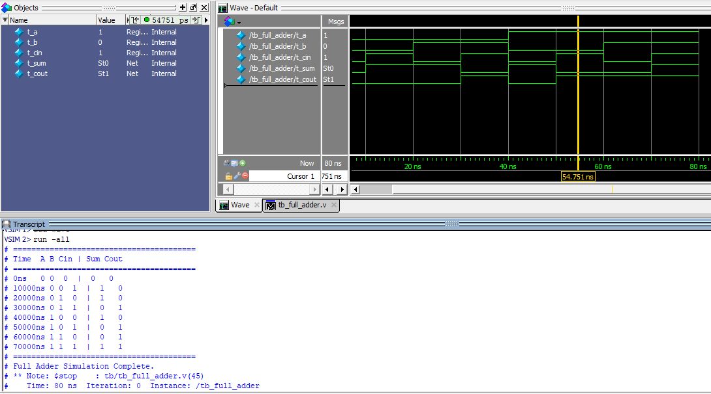

# Full Adder Design and Verification

[](#)
[](#)

## Project Overview
This repository contains the RTL design and verification of a 1-Bit Full Adder implemented using Dataflow modeling in Verilog. The project features an exhaustive testbench that validates all 8 possible input combinations to ensure 100% functional accuracy.

---

## Repository Structure

```text
Full-Adder-Verilog/
├── rtl/                        # Synthesizable Verilog Source Code
│   └── full_adder.v            # Dataflow implementation (assign)
├── tb/                         # Automated Verification Testbench
│   └── tb_full_adder.v         # Exhaustive 8-state testbench
└── docs/                       # Verification outputs and waveforms
    └── full_adder_wave.png     

```

---

## How to Run the Simulation

To run this project locally, you will need **ModelSim** installed and added to your system's environment variables.

1. **Clone the repository and open it in VS Code:**
```bash
git clone https://github.com/abdulsamad42232/Full-Adder-Design-and-Verification.git
cd Full-Adder-Verilog

```


2. **Open the VS Code Terminal (`Ctrl + ~`) and compile the design:**
```bash
# Create the logical working library
vlib work

# Compile both the hardware design and the testbench
vlog rtl/full_adder.v tb/tb_full_adder.v

```


3. **Launch the Simulation:**
```bash
# Start ModelSim targeting the testbench
vsim work.tb_full_adder

```


4. **View the Waveforms (Inside ModelSim):**
Once the ModelSim GUI opens, type the following in its command line to see the visual timing diagram:
```bash
add wave *
run -all

```


*(Press the **`F`** key on your keyboard while clicking the wave window to auto-fit the zoom!)*

---

## Console Output: Automated Truth Table

The testbench utilizes `$monitor` to automatically generate the following truth table in the simulation console, proving correct arithmetic logic:

```text
========================================
Time	A B Cin | Sum Cout
========================================
0ns	0 0  0  |  0   0
10ns	0 0  1  |  1   0
20ns	0 1  0  |  1   0
30ns	0 1  1  |  0   1
40ns	1 0  0  |  1   0
50ns	1 0  1  |  0   1
60ns	1 1  0  |  0   1
70ns	1 1  1  |  1   1
========================================
Full Adder Simulation Complete.

```

---

## Waveform Verification
The waveform below visually verifies the automated truth table, showing the correct boolean logic transitions for the Sum and Carry-Out signals across all 8 input combinations.



## 🛠️ Tools & Technologies Used

* **Hardware Description Language:** Verilog
* **Simulation Engine:** Mentor Graphics ModelSim
* **Development Environment:** Visual Studio Code

---

*Developed by Abdul Samad Khan*

```
